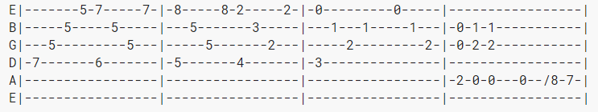
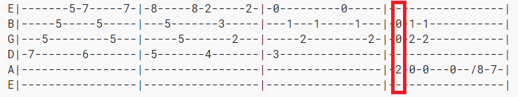

# Générer du texte et de la musique avec les modèles n-grammes

Ouvrez votre téléphone et commencez à tapper un message. "Je vais être en". Il y a de fortes chances que votre système de recommandation affiche le mot "retard". Félicitations vous venez très probablement d'utiliser un modèle n-gramme. 
> Mais en quoi ça consiste exactement un modèle n-gramme?
---
## 1. Un peu de théorie (désolé pour les maths)

### 1.1 Représenter le langage
Un modèle, comme son nom l'indique, sert à *modéliser. En l'occurence ce que l'on cherche ici à modéliser c'est le langage. On peut considérer que chaque phrase a une **probabilité d'apparition* dans l'ensemble des phrases possibles, constitués des mots de la langue française. 

> Mais nous on cherche à générer du texte non? Pas à modéliser la langue? 
> C'est vrai, dans l'idée. Mais comme en physique où comprendre comme une planète se déplace permet de prédire sa position future, modéliser la langue permet de créer des structures "cohérentes" avec cette dernière.

Le problème... c'est qu'il est impossible de connaître toutes les phrases existantes, et surtout impossible de connaître leur fréquence d'apparition. 

Une solution serait alors de modéliser la probabilité d'une phrase en fonction de la probabilité conditionnelle des mots la constituant. C'est à dire prédire l'apparition d'un mot n en fonction des probabilité d'apparition de tous les mots de n-1 à 1.

> Par exemple pour une phrase s = "Je suis fatigué." 
>
> P(s) = P("je") * P("suis" | je) * P("fatigué" | ("suis" |"je"))
> 
> Pour plus d'informations: <a href="https://fr.wikipedia.org/wiki/Formule_des_probabilités_composées">Les probabilités composées</a>

### 1.2 Markov à la rescousse!
Malheureusement cela ne nous aide pas énormément. En effet, que se passe-t-il si l'on cherche à calculer les probabilités des phrases suivantes:
- Je suis fatigué
- Il se fait tard et je suis fatigué
- La journée a été longue et je suis fatigué

Il faudra connaître à chaque fois la probabilité de "fatigué" *sachant* tous les mots précédents. Ce qui impliquerait d'avoir une base énorme de texte pour pouvoir calculer tous les cas particuliers un par un. Et encore, face à une phrase non présente dans l'ensemble d'apprentissage, cela ne marcherait pas.

*Cependant* (et là tout devient facile).

On peut remarquer que dans les trois phrases les mots précédant "fatigué" sont toujours "je" et "suis".

Et bien le principe du modèle n-gramme est de considérer que cet "historique" de mots précédant "fatigué" peut être approché par un sous ensemble de taille *n* de cet historique. On peut alors parler de chaîne de Markov d'ordre n - 1. 

> Une hypothèse de Markov est le fait de considérer que certaines suites d'événements peuvent être expliquées soit de façon complètement indépendantes soit en utilisant un historique réduit. On parle  d'ordre n - 1 car on utilise les n - 1 mots précédant le mot n pour prédire la probabilité de ce dernier. 
Pour plus d'informations: <a href="https://en.wikipedia.org/wiki/Markov_chain">Les chaines de Markov</a> (voir chaines avec mémoire).

Mettons que l'on prenne *n = 2*, le calcul de la probabilité d'apparition de "fatigué" dans la phrase "Il se fait tard et je suis" sera tout simplement P("fatigué" | "suis").

Ce que l'on va alors chercher à faire, c'est connaître les fréquences d'apparition de tous les bigrammes de l'ensemble d'apprentissage.
Reprenons nos phrases de tout à l'heure et ajoutons la phrase:
- "Je m'appelle Tom et je vais dans l'espace."

Nous pouvons alors calculer les probabilités des bigrammes contenant par exemple le mot "je": 

    S[je] = {
        P(suis | je) = 3/5
        P(vais | je) = 1/5
        P(m'appelle | je) = 1/5
    }

Cela revient à dire que si l'on rencontre le mot "je" dans une phrase, il y a 60% de chances qu'il soit suivi du mot "suis", et 20% de chances qu'il soit suivi de "vais" ou "m'appelle". 

Le système de génération de texte est alors enfantin. En prenant les probabilités cumulées du bigramme ci dessus, avec X le mot à prédire, on peut constuire les intervalles de prédiction pour chaque mot.

| X  | P(X)   | Cumulé| Intervalle
|---|---|---|---|
| Rien  | 0 | 0 |Vide
| "suis"  | 0.60  | 0.60 |[0;0.60]
| "vais"  | 0.20  | 0.80 |]0.60;0.80]
| "m'appelle"  | 0.20  | 1 |]0.80;1]


Il suffit de tirer un nombre aléatoire ***y*** entre 0 et 1, et de choisir le mot tel que ***y*** soit compris dans l'intervalle du mot.

> Ex: si je tire 0.70, on a  0.60 < 0.70 < 0.80. Le mot généré sera donc "vais".

Bien sûr, prédire un mot en prenant seulement en compte le mot d'avant est assez réducteur et le résultat sera souvent assez limité, mais dès que l'on utilise des valeurs de *n* égales à 4 ou 5, la cohérence du texte généré augmente. 

> *Attention !* Plus *n* augmente, plus le contenu généré risquera de coller au texte originel et de ne plus rien proposer d'original. C'est ce qu'on appelle communément en machine learning *l'overfitting.*
>
> Il faut donc faire attention en choississant *n*, on pourra se permettre des valeurs plus élevées sur des corpus d'entraînement plus gros. Mais généralement les 4-grammes (comme un breton à 9h du matin) ou les 5-grammes donnent des résultats corrects.

### 1.3 Cas d'usage

Une brève parenthèse avant de passer au code lui même, pour parler des cas d'usages 'réels' de ces modèles. 
Les modèles n-grammes sont utilisés plus souvent qu'on ne peut le penser. Notamment en complétion des algorithmes de reconnaissance automatique du langage écrit ou parlé, ou même encore pour aider à la reconnaissance de patterns lors du séquençage ADN.

> Imaginez un logiciel de reconnaissance de caractères (OCR) à qui l'on donnerait la phrase suivante en entrée "J'ai mangé des pêches", et que le dernier mot fort mal écrit, soit reconnu à 70% comme "bêches" et à 30% comme pêches. Notre algorithme pourra alors tenter de s'appuyer sur un modèle 4-grammes (toujours aucun rapport avec le chouchen), pour infirmer sa déduction puisque le mot bêche n'apparait jamais après la séquence "ai mangé des".

En réalité, ce type de modèle est loin de s'appliquer simplement aux mots, et peut être utilisé pour toute suite logique de n éléments au sein d'un ensemble, cela peut être des lettres (pour prédire caractère par caractère ce qui va être écrit), avec des sons, des suites de pixels... Le système est simple, les possibilités nombreuses.

-----

Ces bases théoriques étant posées, et le principe de génération par n-gramme clair comme de l'eau de roche, passons maintenant à une partie plus amusante : la pratique.

## 2. Implémentation en python

Est décrite ci-dessous une implémentation assez naïve du modèle et en pseudo code. Pour ceux voulant aller plus loin ou tester eux même, le code complet avec des méthodes pour preprocesser le texte est disponible <a href="https://github.com/Tyrannas/n-grams-experiments">ici.</a>

Résumons donc ce dont nous avons besoin pour faire fonctionner notre modèle:

- Un corpus d'apprentissage pour calculer les probabilités.
- Une méthode d'apprentissage qui, pour chaque n-gramme, calculera lesdites probabilités.
- Une méthode de génération une fois l'apprentissage terminé.

### 2.1 Les structures de données

La première question qui se pose est celle de la représentation des n-grammes. Pour rappel, il faut pouvoir associer des probabilités pour le nième mot de suivre n - 1 mots.

Une solution est donc, pour chacune de ces suites de n - 1 mots (que nous pourrons appeler ici (n-1)-gramme), de tenir un dictionnaire de mots à 'prédire' associant le mot à sa probabilité de suivre la suite. Ainsi pour *n = 4* la suite 'homme sois plus' aura pour dictionnaire:

    {
        'violent': 0.33,
        'puissant': 0.33,
        'ardent': 0.33
    }

Dans les faits, l'apprentissage se fera au fur et à mesure, il faudra donc être en mesure de recalculer les probabilités si l'on ajoute un nouveau mot au dictionnaire. Or comment calculer cette probabilité?

    P(mot) = nb_occurences_mot / nb_total_occurences

Pour cela, on rajoute aussi la notion d'occurence dans le dictionnaire:

    {
        'violent': {'count': 2, 'proba': 0.33},
        'puissant': {'count': 2, 'proba': 0.33},
        'ardent': {'count': 2, 'proba': 0.33}
    }
Et on gardera en parallèle pour chaque suite de mots un compte du total des count du dictionnaire (qui pourrait aussi être recalculé à chaque fois).

Ainsi, si l'on rencontre à nouveau le mot 'violent' après la suite "homme sois plus", on obtiendra:

    {
        'violent': {'count': 3, 'proba': 0.43},
        'puissant': {'count': 2, 'proba': 0.29},
        'ardent': {'count': 2, 'proba': 0.29}
    }

Il suffit de procéder de manière identique pour chaque (n-1)-gramme unique trouvé dans le texte.

### 2.1 L'apprentissage

On utilisera ici deux classes:
- une classe NGram chargée de la mise à jour du dictionnaire abordé plus tôt. Nous créerons donc une instance de NGram par (n-1)-gramme trouvé.
- une classe Model chargée de l'apprentissage global et du management des instances NGram.

Une fois cela établi l'implémentation est assez simple.

```python
class NGram:
    def __init__(self):
        self.words_to_predict = {}
    
    def add_word(self, word):
        # si le mot existe déjà on incrémente son count
        # sinon on créé le mot avec un count de 1
        # on recalcule les probas
    
    def compute_proba(self):
        # total_count = somme des count de chaque mot de self.words_to_predict
        # pour chaque mot de self.words_to_predict:
            # sa proba vaut son propre count / total_count
```
```python
class Model:
    def __init__(self, n):
        # n la taille du n-gramme
        # comme on prendra des suites de mots de taille n - 1, pour s'éviter de réécrire n - 1 on assigne self.n = n - 1
        self.n = n - 1
        self.ngrams = {}
    
    def train(self, texte):
        # on sépare le texte en tableau de mots en splittant sur les espaces
        # pour i = self.n jusqu'à la fin du texte:
            # on prend self.n mots à partir de i
            # on créé un identifiant composé de ces mots qui nous servira à identifier ce ngramme dans le dictionnaire self.ngrams 
            # on créé self.ngrams[id] = Ngram() s'il n'existe pas
            # on utilise la méthode add_word du ngramme nouvellement créé en lui passant le mot suivant les self.n mots:
            # ==> self.ngrams[id].addword[texte[i + self.n + 1]]
 ```       


Et voilà, une fois le texte parcouru en entier par la méthode train, toutes vos probabilités devraient être calculées et il ne reste plus qu'à générer du texte.

### 2.3 La génération

Reprenons nos deux classes et ajoutons les méthodes de génération:
- la classe NGram a besoin de tirer un nombre aléatoire et de renvoyer un mot.
- la classe Model elle doit sélectionner le bon objet Ngram en fonction de la séquence d'entrée pour générer un mot.

python
class NGram:
    ...
    def generate(self):
        # on tire un nombre entre 0 et 1
        # on sélectionne le mot dont la probabilité cumulée est supérieure à ce nombre et on renvoie le mot

class Model:
    def generate(self, words):
        # on créé un id à partir des mots
        # on teste si cet id est enregistré dans les ngrammes
        # si oui on demande à ce ngramme de générer un mot


Et voilà, c'était extrêmement simple. On peut ensuite modifier un peu la méthode generate de la classe Model pour générer automatiquement de plus longues suites de mots en créant à chaque fois une nouvelle séquence en enlevant le premier mot de la séquence d'avant, et en rajoutant le mot qui vient d'être prédit.

    "is Major Tom" ==> "to"
    "Major Tom to" ==> "Ground"
    "Tom to Ground" ==> "Control"
    "to Ground Control" ==> ...
    etc.

Et maintenant testons un peu ce modèle avec des exemples concrets.

## 3. Les exemples
On utilise pour la suite différents corpus, en l'occurence les trois mousquetaires en français, et le seigneur des anneaux intégral en anglais. 
On génèrera aléatoirement 2 phrases à chaque fois, en ne donnant pas de mot de départ, mais en prenant au hasard un n-gramme parmi ceux appris.
### 3.1 Les trois mousquetaires
Ce texte présente trois difficultés: 
- c'est un texte qu'on peut qualifier de littérature "classique" d'un siècle passé, et les tournures sont parfois un peu compliquées et à rallonge. 
- le français est moins facile à générer que l'anglais du fait de ses caractères additionnels, et demande donc un peu plus de pré-traitement pour être utilisable
- le texte ne fait "que" 250 000 mots, ce qui limite l'apparition de longue chaines de mots identiques et le risque de coller trop au texte est donc augmenté.

Pour **n=3** (on se base donc sur deux mots d'historique):

> "L'une était un signal. Désormais il faut être libre et si vous avez eu tort."

Pour **n=4**
 > "Athos porthos et aramis se placèrent à une table et se mit à table mangea peu et ne but que de l'eau. À mon tour."


Pour **n=5**
> "Le mot est un peu dur. Vous avez baisé la main de la porte."

> "C'est vous d'artagnan c'est vous athos dit le jeune homme je vous l'avoue d'autant mieux mon cher monsieur bonacieux que je vois qu'on ne peut rien vous cacher. Enfin tout à coup une voix pleine de douceur et de majesté."

On peut dores et déjà saisir un problème inhérent aux n-grammes, s'ils respectent bien la syntaxe, les phrases n'ont pas toujours énormément de cohérence entre elles.

### 3.2 Le seigneur des anneaux

Ce texte est un peu plus long - 800 000 mots - (et les corpus utilisés en machine learning peuvent dépasser le milliard de mot, 800 000 reste donc assez faible.)

Pour **n=3**
> "Because an old inn that is the spirit of mordor and became separated from the beginning of their cavalry, turned and went after him. All's clear now."

Une auberge tueuse.
> "Skulls and bones black in cinders lie beneath the roots of the food i send with you. Dreadful as the valley."

Et un repas peu engageant.

Pour **n=4**
> "Fierce voices rose up to greet it from across the valley. When dinner was over they began to tell on him as he swayed it from side to side the king's party came up under the lowering clouds with crimson."

Une belle soirée.
> "Peace and freedom do you say. Let me get my hands on you."

Pour **n=5**
> "Not very near and yet too near it seems. As it was he had a desperate fight before he got free."

> "Yet at the last beren was slain by the same orcs whom you destroyed'. That we now know too well."

Et enfin un bel exemple d'overfitting, le modèle a ressorti exactement le texte mot pour mot avec cet exemple:

> "An author cannot of course remain wholly unaffected by his experience but the ways in which a storygerm uses the soil of experience are extremely complex and attempts to define the process are at best guesses from evidence that is inadequate and ambiguous."

La raison est très probablement que le registre que l'on trouve ici (celui de l'écriture) est assez différent du reste du livre qui tend plus vers le fantastique et le guerrier. 

On voit donc que notre modèle basique peut produire des textes certes un peu étranges, mais presque tout le temps avec un assez bon respect de la syntaxe. 

Pour terminer, après avoir testé la génération sur du texte, pourquoi ne pas la tester sur de la musique?

### 3.3 Tablatures de guitare

Tout comme pour la génération de mots, la génération de musique nécessite d'avoir un corpus d'apprentissage. Diverses solutions existent, mais l'une des plus simples à mettre en oeuvre reste de se baser sur des tablatures de guitares, puisque des milliers de tablatures sont disponibles <a href="https://www.ultimate-guitar.com/explore">sur ultimate guitar</a>.

> Une tablature de guitare est un fichier texte représentant les six cordes de l'instrument, et pour chacune de ces cordes les endroits où il faut appuyer à un instant t:
> 

Le plus gros du travail a été de récupérer les tablatures, de les parser, et de les nettoyer. (Mais ceci n'étant pas le sujet de cet article, tous les scripts sont disponibles <a href="https://github.com/Tyrannas/n-grams-experiments/tree/master/tabs/scripts">ici</a>.)

L'étape manquante consiste juste à définir ce qu'est un "mot" lorsqu'on parle d'une tablature. 

On prendra ici toutes les notes jouées au même moment sur les différentes cordes. Cela peut donc être représenté par un tableau de six éléments:

    ['-', '0', '0', '-', '2', '-']

> Ce tableau correspondrait à la portion en rouge sur la tablature du dessus: 


En transformant chaque partition en tableaux de tableaux, on peut alors le donner en entrée de notre modèle et écouter les résultats joués rapidement par mes soins. (Désolé pour la mauvaise qualité audio et le manque de fluidité mais ces 'morceaux' ont été joués à leur découverte).

Si les audios ne marchent pas sur votre navigateur, les fichiers sont disponibles <a href="https://github.com/Tyrannas/n-grams-experiments/tree/master/audio">ici.</a>

Pour **n=2**

<audio
        controls
        src="./audio/n2.mp3">
            Your browser does not support the
            <code>audio</code> element.
    </audio>

Pour **n=3**

<audio
        controls
        src="./audio/n3.mp3">
            Your browser does not support the
            <code>audio</code> element.
    </audio>

Pour **n=4**

<audio
        controls
        src="./audio/n4.mp3">
            Your browser does not support the
            <code>audio</code> element.
    </audio>


Cela reste en fin de compte assez expérimental mais peut être une potentielle source d'inspiration qui pourra être par la suite "corrigée" par le musicien pour que le résultat soit plus homogène!

## Pour aller plus loin

Nous avons vu ici comme générer du contenu automatiquement à partir des modèles n-grammes. Aujourd'hui de nombreuses autres méthodes existent dans le monde de la création automatique (réseaux de neurones LSTM pour le texte, GAN pour l'image etc...). On pourra notamment penser à <a href="https://openai.com/blog/better-language-models/">l'initiative Open AI </a> qui a récemment produit des résultats assez impressionants sur la génération automatique d'article de journal à partir d'un simple résumé.
Cependant les n-grammes restent une solution très simple à mettre en place et pourtant assez robuste dans ses résultats (bien qu'ils soient plus utilisés comme support à d'autres algorithmes qu'utilisés de façon indépendante, voir 1.3)

Il existe malgré tout des moyens d'optimiser le modèle basique présenté ici. On pourrait par exemple entrainer des modèles avec des *n* différents, puis essayer de les combiner. Il existe également des méthodes de smoothing, permettant d'homogénéiser les probabilités des mots prédits pour limiter l'overfit au texte. D'autres méthodes encore permettent de prendre en compte des mots jamais rencontrés lors de la prédiction...

Une dernière piste d'amélioration et une critique majeure des n-grammes pourrait être celle de la sémantique. En effet si les n-grammes permettent de conserver une syntaxe assez cohérente, le sens lui même de la phrase générée n'est parfois pas cohérent. Si l'on reprend l'un de nos tous premiers exemples:

    Il se fait tard et je suis fatigué.

Même s'il existe effectivement des chances raisonnables de prédire fatigué avec seulement "je suis", la première partie de la phrase "il se fait tard" apporte un élément de sens non négligeable et qui pourrait fortement accroitre les probabilité d'avoir le mot "fatigué" en fin de phrase.

Pour pallier à ce problème des modèles tels que <a href="https://medium.com/nearist-ai/word2vec-tutorial-the-skip-gram-model-c7926e1fdc09"> word2vec </a> qui construisent des représentations vectorielles des mots à partir du contexte de ces derniers. Plus précisémment, en utilisant non pas des n-grammes, mais des <a href="">skip-grammes!</a> Cela permet de conserver l'aspect sémantique des phrases.

On pourrait ainsi imaginer un système alliant n-grammes pour la syntaxe, et word2vec pour orienter le choix du mot à prédire.

Mais cela serait un sujet d'article à part entière. 

Merci de votre lecture.
